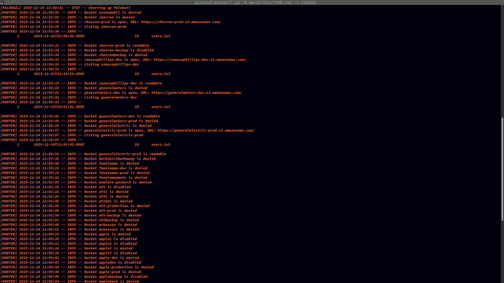

# palebail

I was going to write a bunch of stuff for this, but you get the idea. Open S3 buckets bad, "cloud" infra security good. This was a private project for a while but I'm not working on it anymore so might as well make it public.

**WARNING:** Using this tool can get your IP rate-limited by Amazon. You have been warned.

### Usage

#### Screenshot

</img>

```
usage: palebail.py [-h] 
  [-m modifiers] [-o out]
  [-k keyword] [-K keyfile]
  [-t threads] [-s] [-v] 

optional arguments:
  -h, --help            show this help message and exit
  -m modifiers, --modifiers modifiers
                        Modifiers wordlist for common bucket names
  -o out, --out out     Output file (default is <timestamp>.log in ./logs/
  -k keyword, --keyword keyword
                        Keyword to base the search around
  -K keyfile, --keyfile keyfile
                        List of keywords to enumerate
  -s, --silent          Silent mode - only prints Found buckets
  -v, --verbose         Verbose mode, log everything to stdout and logfile
  -t, --threads         Number of threads to use
```
### Examples

This will search all buckets with keyword+modifier and output to `output.log`, printing all bucket data to `STDOUT` as well.

```python3
palebail.py -k keyword -v -m modifiers/default.txt -o output.log
```

This is an example of searching all keywords in `wlist.txt` with modifiers from `modifiers/default.txt`, and only printing to `STDOUT` buckets that have been found.

```python3
palebail.py -K wordlists/wlist.txt -s
```

### References

1. https://docs.aws.amazon.com/AmazonS3/latest/API/s3-api.pdf#API_Operations_AWS_S3_Control
  - The entire REST API is available for public use. If you want to use `delete` or `put` operations, that is also achievable through this API.
  - Originally I was going to implement every single thing in there for the sake of learning, but a lot of it doesn't make much sense to have in a security auditing tool (namely the `delete` and `put` operations).

2. https://gist.githubusercontent.com/erikig/826f49442929e9ecfab6d7c481870700/raw/95f5fa24102ab610a37564b200e5acffe75a8ace/common-domain-prefix-suffix-list.tsv
  - originall found via https://news.ycombinator.com/item?id=23287419